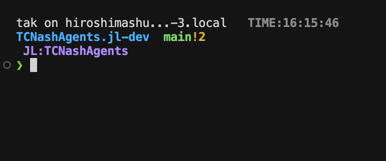

# lab-shell

研究室・ゼミ向けの共有シェル設定です。  
導入はOSごとに1コマンドで実行できます。

## まずこれだけ

### Windows (推奨)

```powershell
irm https://raw.githubusercontent.com/daihiko-lab/lab-shell/main/.lab-shell/scripts/bootstrap-shared-core-win.ps1 | iex
```

必要ならWindowsを再起動して、同じコマンドをもう1回実行してください。

### macOS (zsh)

```bash
curl -fsSL https://raw.githubusercontent.com/daihiko-lab/lab-shell/main/.lab-shell/scripts/bootstrap-shared-core-mac.sh | zsh
```

### Linux / WSL2 (bash)

```bash
curl -fsSL https://raw.githubusercontent.com/daihiko-lab/lab-shell/main/.lab-shell/scripts/bootstrap-shared-core-linux.sh | bash
```

## Windowsで自動化される内容

- `Windows PowerShell 5.1`から実行しても動作
- `PowerShell 7`未導入なら導入を試行
- `git`未導入なら導入を試行
- `WSL2 (Ubuntu)`未導入なら有効化を試行 (再起動が必要な場合あり)
- WSL側の`bash`設定と`starship`導入も試行

## 推奨運用方針

- Windowsユーザーの標準は`PowerShell 7`
- プログラミング演習やUnixコマンド学習は`WSL2 (Ubuntu + bash)`
- 旧`Windows PowerShell 5.1`は互換目的で残し、通常運用では使わない
- `cmd.exe`は旧手順の実行時のみ利用 (通常運用では非推奨)

## 含むもの

- `starship`によるPrompt設定
- 最小alias (`gs`,`gd`,`ga`,`gc`,`gp`,`ll`,`..`,`...`,`r`)
- macOS (`zsh`) / Windows (`PowerShell`) / Linux・WSL2 (`bash`) の導入スクリプト

## 更新

初回導入と同じコマンドを再実行してください。

## 反映されないとき

- 既存ターミナルをすべて閉じて新規ターミナルを開く
- VSCode / Cursorでは`Developer: Reload Window`を実行
- WSL側は`exec bash`またはターミナル再起動

## アンインストール

### macOS

```bash
zsh ~/lab-shell/.lab-shell/scripts/uninstall-shared-core-mac.sh
```

### Windows

```powershell
& "$HOME\lab-shell\.lab-shell\scripts\uninstall-shared-core-win.ps1"
```

### Linux / WSL2

```bash
rm -f ~/.bashrc ~/.config/starship.toml
```

## ターミナル表示例



## 詳細ドキュメント

詳細は`docs/shared-core.md`を参照してください。
